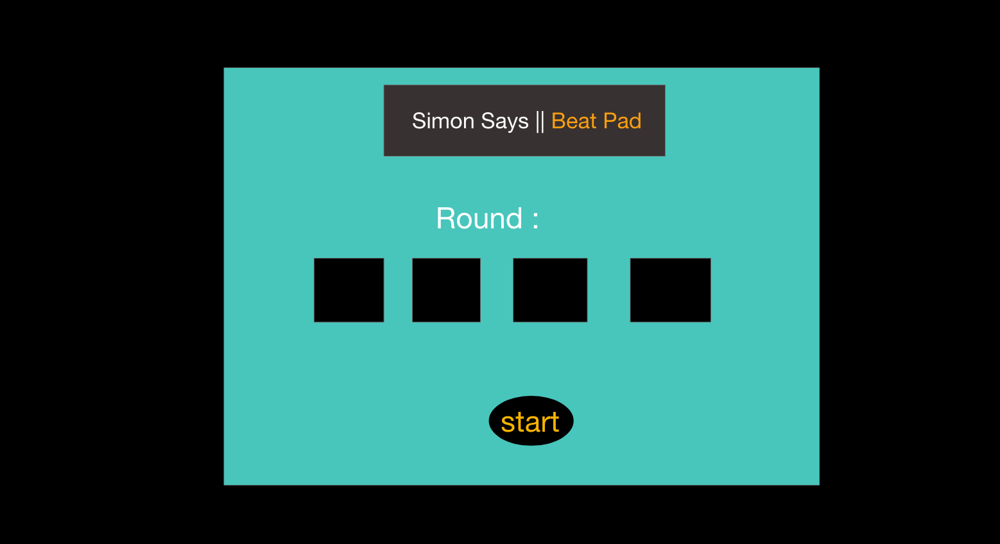

# Simon-Drum-Pad
Demo: https://germs31.github.io/Simon-Drum-Pad-/

# Game Rules
Objective: 
- Match every pattern given to you by Simon
- This version is an infinite game. You play untill you lose. 

# Introduction 
Simon was released 1978. It has had a remarkable succuess for years. The concept of Simon has always been very appealing, entertaining, and great for muscle memory. the recreation of this game involved javascript essentials and was very fun to recreate and add a little musical twist to.  

# Languages Used 
- HTML5
- CSS3 
- Javascript

